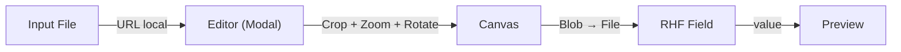

# Image Crop Field

Componente de elite para upload e recorte de imagens, ultra-otimizado para o ecossistema moderno do React. Oferece uma experiência de usuário premium com suporte a Next.js 15, TypeScript, React Hook Form e processamento via Canvas API de alto desempenho.

<h1 align="center">
  
</h1>

## ✨ Funcionalidades

- **🚀 Engine Híbrida**: Combina `react-easy-crop` (para melhor UX de arraste/zoom no modo fixo) com `react-image-crop` (para precisão milimétrica no modo livre).
- **🎨 Visual Premium**: Design em Dark Mode com efeitos de glassmorphism e animações suaves.
- **✂️ Corte Livre Inteligente**: Alternância em tempo real entre proporção travada e seleção manual de área.
- **📐 Resolução de Elite**: Gere arquivos finais com dimensões exatas (ex: 1200x630) independente da escala do preview.
- **🔍 Controles Avançados**: Zoom dinâmico (0.5x a 5x) e rotação precisa (-45° a +45°).
- **🧩 Integração Nativa RHF**: Totalmente compatível com `Controller` do React Hook Form e validações Zod.
- **⚡ Next.js 15 Ready**: Otimizado para Turbopack e React 19 (Server/Client components).

---

## 🛠️ Tecnologias de Ponta

- **Framework**: [Next.js 15](https://nextjs.org/)
- **Linguagem**: [TypeScript](https://www.typescriptlang.org/)
- **Estilização**: [Tailwind CSS 4](https://tailwindcss.com/)
- **Formulários**: [React Hook Form](https://react-hook-form.com/)
- **Validação**: [Zod](https://zod.dev/)
- **Engines de Crop**: `react-easy-crop` & `react-image-crop`

---

## 🏗️ Estrutura do Projeto

```text
src/
├── app/                  # Rotas e layout (Next.js 15)
├── components/
│   ├── image-upload.tsx  # Componente Core (ImageCropField)
│   ├── examples-section.tsx # Seção de Exemplos e Laboratório
│   ├── form-exemple.tsx  # Implementação de formulário real
│   └── footer.tsx        # Rodapé institucional
└── public/               # Ativos estáticos
```

### Fluxo de Dados



---

## 🚀 Como Utilizar

### 1. Integração com React Hook Form + Zod

Esta é a forma mais poderosa de usar o componente, garantindo que o arquivo final seja validado antes do envio.

```tsx
import ImageCropField from "@/components/image-upload";
import { Controller, useForm } from "react-hook-form";
import { z } from "zod";
import { zodResolver } from "@hookform/resolvers/zod";

const schema = z.object({
  avatar: z.instanceof(File).refine((f) => f.size < 2 * 1024 * 1024, "Max 2MB"),
});

export default function ProfileForm() {
  const { control, handleSubmit } = useForm({
    resolver: zodResolver(schema),
  });

  return (
    <form onSubmit={handleSubmit(onSubmit)}>
      <Controller
        name="avatar"
        control={control}
        render={({ field }) => (
          <ImageCropField
            field={field}
            aspect={1}
            cropShape="round"
            output={{ width: 400, height: 400, quality: 0.9 }}
            label="Foto de Perfil"
          />
        )}
      />
    </form>
  );
}
```

### 2. Modo Banner (Widescreen)

```tsx
<ImageCropField
  value={banner}
  onChange={setBanner}
  aspect={16 / 9}
  cropShape="rect"
  output={{ width: 1920, height: 1080 }} // Alta resolução garantida
  viewportWidth={400} // Tamanho controlado na UI
/>
```

---

## ⚙️ Propriedades (Props)

| Prop               | Tipo              | Descrição                                                      |
| :----------------- | :---------------- | :------------------------------------------------------------- |
| `field`            | `object`          | Objeto retornado pelo `Controller` do RHF.                     |
| `aspect`           | `number`          | Proporção do recorte (Ex: `16/9`).                             |
| `cropShape`        | `round` \| `rect` | Formato visual do seletor.                                     |
| `output`           | `object`          | Configurações do arquivo final (`width`, `height`, `quality`). |
| `allowFreeCrop`    | `boolean`         | Habilita o modo de alteração livre de aspecto no editor.       |
| `viewportWidth`    | `number`          | Largura máxima do preview na interface.                        |
| `maxFileSizeBytes` | `number`          | Limite de tamanho de arquivo no cliente.                       |

---

## 🔬 Laboratório (Playground)

O projeto conta com uma rota de **Laboratório** onde você pode testar em tempo real:

- Troca de formatos (Círculo vs Retângulo).
- Ativação/Desativação de Corte Livre.
- Teste de diferentes proporções.
- Gerenciamento de Grid e Zoom inicial.

---

## Tecnologias Utilizadas

<div align="center">
  
  
  
  
  
  
</div>

## 👨‍💻 Desenvolvedor

| Foto                                                                          | Nome              | Perfil                                                   |
| :---------------------------------------------------------------------------- | :---------------- | :------------------------------------------------------- |
|  | **Jonatas Silva** | [@JsCodeDevlopment](https://github.com/JsCodeDevlopment) |

---

## 📄 Licença

Este projeto está sob a licença [MIT](./LICENSE.md).

<div align="center">
  <sub>Built with ❤️ by <a href="https://github.com/JsCodeDevlopment">Jonatas Silva</a></sub>
</div>
